# UrKey — Secure Password & Credentials Manager

> **Security-first. Clean UI. Fully portable. Built for English (LTR) and Arabic (RTL).**

A standalone Windows desktop password manager that keeps your vault encrypted on disk, ships as a single executable, and mirrors the entire interface when you switch languages.

<p align="center">
  
  
  
  
  
</p>

---

## Overview

UrKey is a full-featured local vault for accounts, bank cards, notes, addresses, and documents. It is designed as a **portfolio-grade** WPF application: layered architecture, MVVM presentation, AES-GCM encryption, and first-class bilingual UX.

### Key Features

| Feature | What you get |
| --- | --- |
| **Single-file portable EXE** | Download `Urkey.exe`, run it — no installer, no external runtime dependency for end users. |
| **Dual language + direction** | English (LTR) and Arabic (RTL) with live language switching and mirrored layout. |
| **Secure local vault** | Master-password unlock, encrypted on-disk storage, session lock / auto-lock, clipboard clear timers. |
| **Password toolkit** | Strength analysis (weak / reused / entropy), password generator, import from CSV/TXT. |
| **Modern WPF shell** | Sidebar navigation, light/dark themes, toast feedback, entry list & grid views. |
| **Clean Architecture** | `Urkey.Core` domain/services + `Urkey.WPF` MVVM UI — testable and extensible. |

---

## Screenshots

Fresh captures from the current build — English (LTR) beside Arabic (RTL).

### Setup & Unlock

| English · LTR | Arabic · RTL |
| :---: | :---: |
| 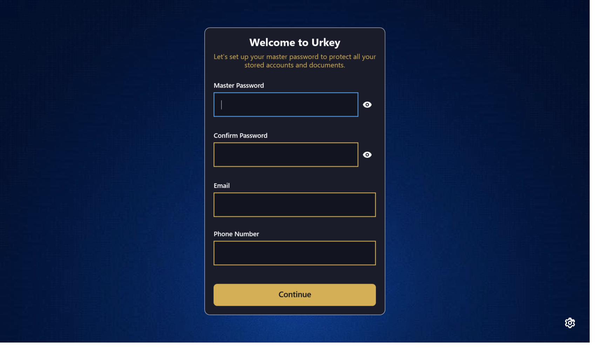 | 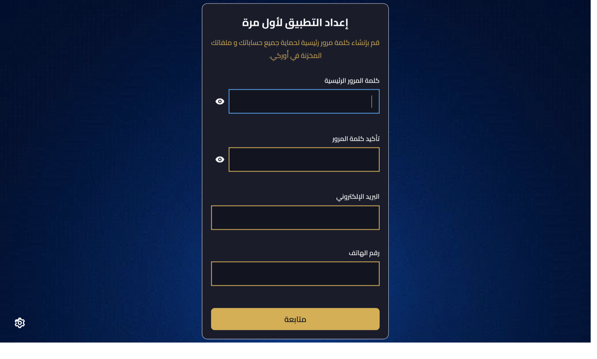 |
| *First-time setup — create your master password* | *إعداد أول مرة — إنشاء كلمة المرور الرئيسية* |
| 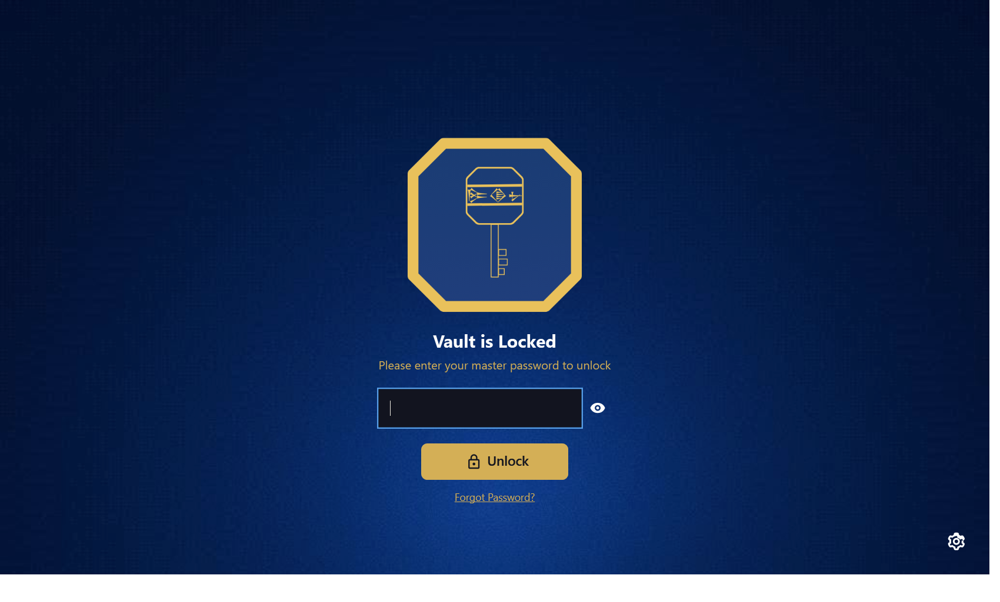 | 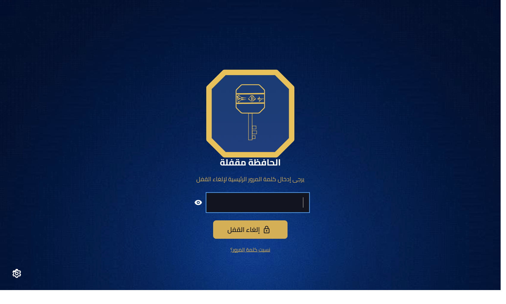 |
| *Unlock — vault locked until the master password is entered* | *فتح القفل — الخزنة مغلقة حتى إدخال كلمة المرور* |

### Settings & Password Tools

| English · LTR | Arabic · RTL |
| :---: | :---: |
| 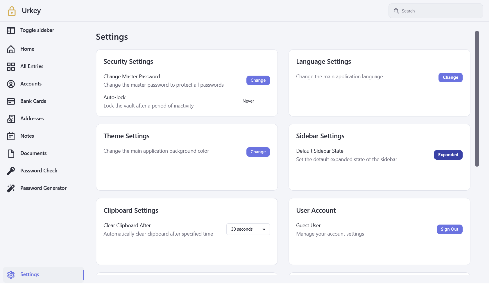 | 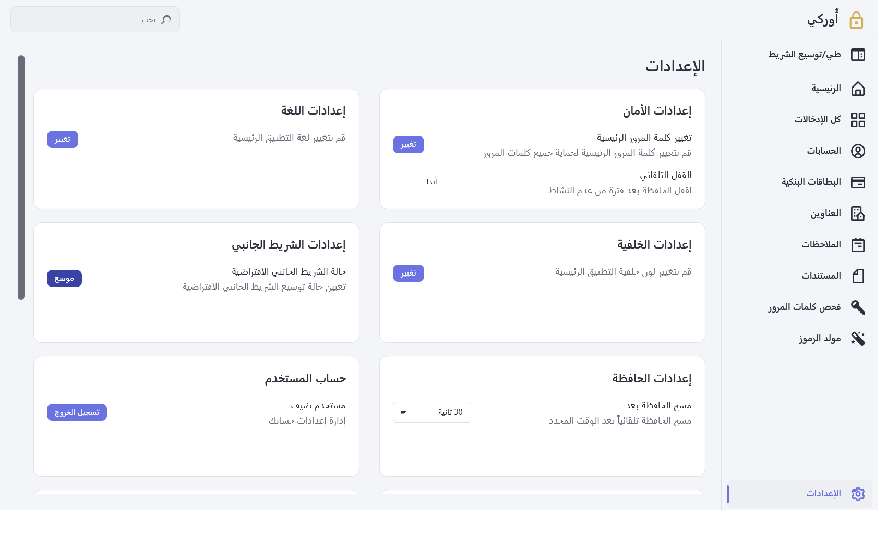 |
| *Settings — language, theme, clipboard, auto-lock* | *الإعدادات — اللغة، المظهر، الحافظة، القفل التلقائي* |
| 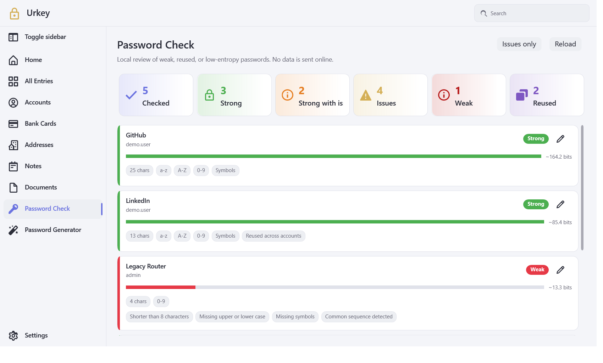 | 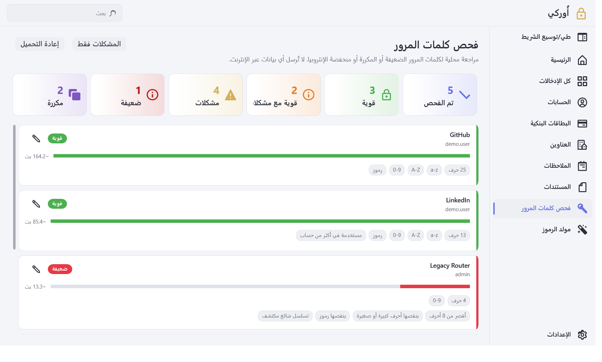 |
| *Password Check — local weak / reused / entropy audit* | *فحص كلمات المرور — تحليل محلي للقوة وإعادة الاستخدام* |
| 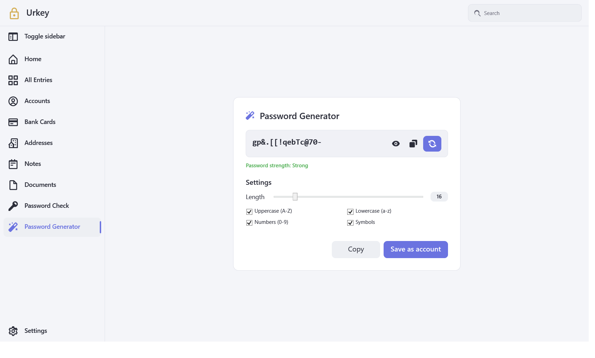 | 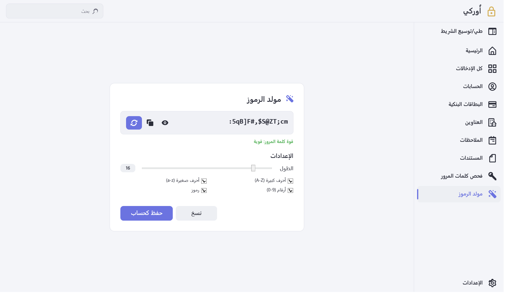 |
| *Password Generator — length, charset, copy & save* | *مولد كلمات المرور — الطول، المجموعات، نسخ وحفظ* |

### Vault Views

| English · LTR | Arabic · RTL |
| :---: | :---: |
| 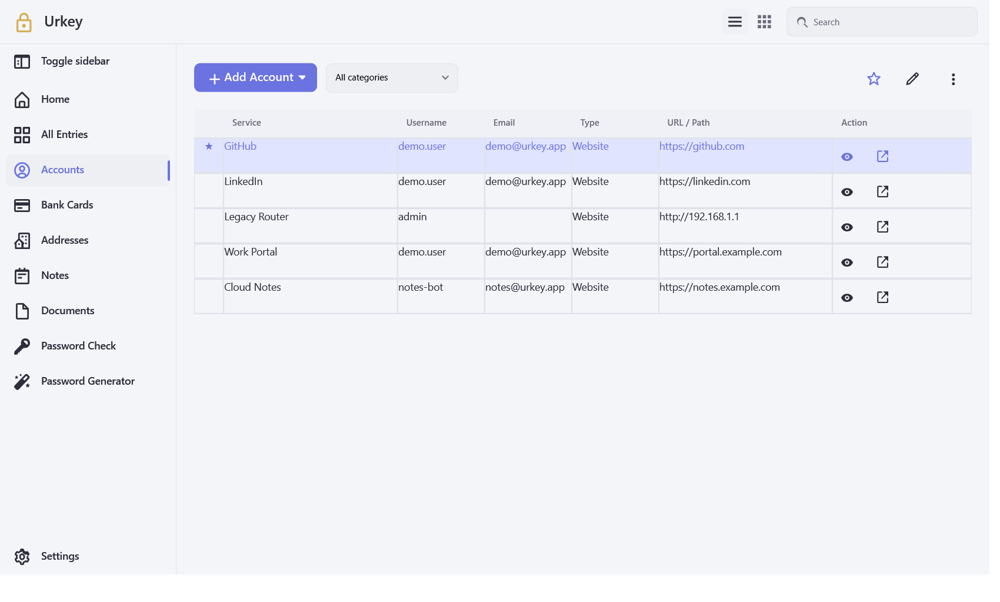 | 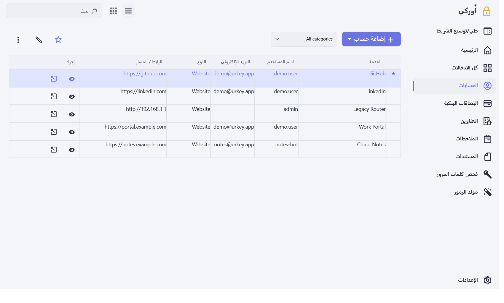 |
| *Accounts — searchable credential list* | *الحسابات — قائمة بيانات اعتماد مع بحث* |
| 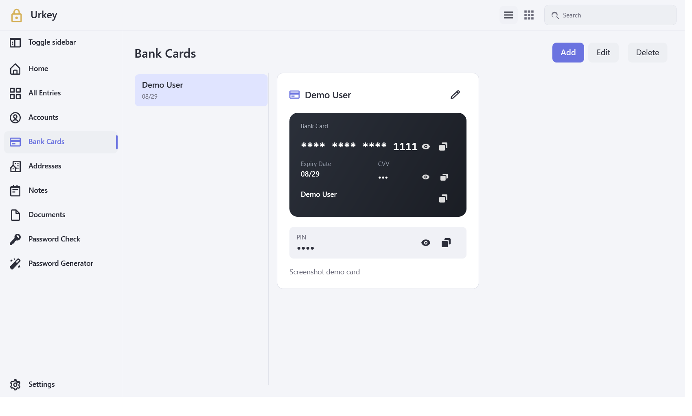 | 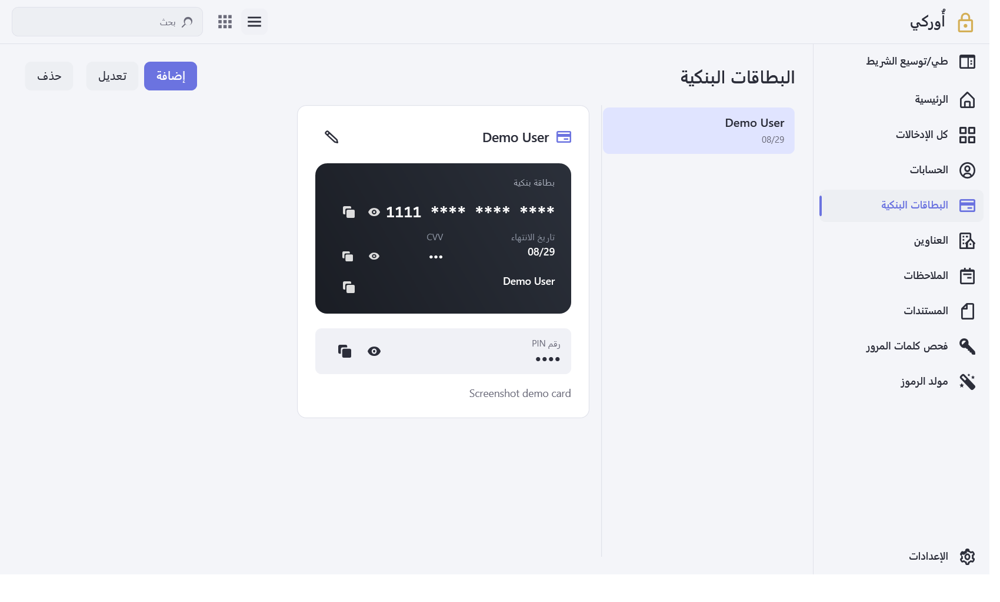 |
| *Bank cards — card entries in the vault* | *البطاقات البنكية — بطاقات محفوظة في الخزنة* |

---

## Download & Quick Start

### Latest release — **v1.0.0**

| Asset | Link |
| --- | --- |
| **Urkey.exe** (portable) | [Download Urkey.exe](https://github.com/Zolfikaar/Urkey/releases/download/v1.0.0/Urkey.exe) |
| Zip package (win-x64) | [Urkey-v1.0.0-win-x64.zip](https://github.com/Zolfikaar/Urkey/releases/download/v1.0.0/Urkey-v1.0.0-win-x64.zip) |
| Release notes | [UrKey v1.0.0](https://github.com/Zolfikaar/Urkey/releases/tag/v1.0.0) |

### Run in 30 seconds

1. Download **`Urkey.exe`** from the release above.
2. Double-click to launch (Windows 10 / 11 · x64).
3. On first run, create your **master password** — this unlocks and encrypts your vault.
4. Switch language anytime from the auth gear or **Settings** (UI direction flips automatically).

No installer. No admin rights required for typical use. Vault data stays on your machine.

---

## Tech Stack & Prerequisites

| Layer | Choice |
| --- | --- |
| Framework | **.NET 8** (WPF, `net8.0-windows`) |
| UI | WPF + XAML resource dictionaries (themes, strings, icons) |
| Patterns | **Clean Architecture** · **MVVM** · DI-friendly services |
| Security | Master-password KDF · AES-GCM vault · session clear on lock |
| Localization | `Strings.en.xaml` / `Strings.ar.xaml` + `AppFlowDirection` |
| Target OS | **Windows 10 / 11 (x64)** |

**To build from source you need:**

- [.NET 8 SDK](https://dotnet.microsoft.com/download/dotnet/8.0)
- Windows 10/11 x64
- (Optional) Visual Studio 2022 with the “.NET desktop development” workload

**End users of the published single-file build** do not need the SDK installed.

---

## Build from Source

```bash
# 1) Clone
git clone https://github.com/Zolfikaar/Urkey.git
cd Urkey

# 2) Restore & build (debug)
dotnet build Urkey.sln -c Debug

# 3) Publish portable single-file Release (win-x64)
dotnet publish .\Urkey.WPF\Urkey.WPF.csproj ^
  -c Release ^
  -r win-x64 ^
  --self-contained true ^
  -p:PublishSingleFile=true ^
  -p:IncludeNativeLibrariesForSelfExtract=true
```

**Output:**  
`Urkey.WPF\bin\Release\net8.0-windows\win-x64\publish\Urkey.WPF.exe`  
(rename to `Urkey.exe` if you prefer the release naming)

> On bash / Git Bash, replace `^` line continuations with `\`.

### Regenerate README screenshots

```bash
dotnet run --project .\Urkey.WPF\Urkey.WPF.csproj -c Release -- ^
  --capture-screenshots .\docs\screenshots
```

Uses an isolated temp AppData folder (your real vault is not touched).

---

## Solution Layout

```
Urkey/
├── Urkey.Core/          # Domain models, encryption, vault & user services
├── Urkey.WPF/           # WPF shell, views, view-models, themes, localization
├── docs/screenshots/    # README visuals (generated)
└── Urkey.sln
```

---

## License

Released under the **MIT License** — free to use, study, and adapt with attribution.

---

<p align="center">
  <b>UrKey</b> — your credentials, encrypted locally, always under your control.
</p>
